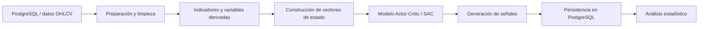

# ModeloAR — Python, PostgreSQL y aprendizaje por refuerzo

Proyecto experimental de analítica y aprendizaje por refuerzo aplicado a series temporales financieras.

El repositorio reúne componentes desarrollados en Python para consultar y preparar datos almacenados en PostgreSQL, construir vectores de estado a partir de información OHLCV e indicadores técnicos, entrenar modelos de tipo Actor-Critic y generar señales para su evaluación posterior.

> El objetivo de esta publicación es demostrar trabajo con Python, SQL/PostgreSQL, procesamiento de datos, APIs y modelos de aprendizaje automático. No se presenta como un sistema de trading listo para producción ni como una recomendación financiera.

## Qué demuestra

- Integración de **Python + PostgreSQL/SQL** mediante `psycopg2`.
- Extracción, transformación y persistencia de datos OHLCV y variables derivadas.
- Procesamiento con **Pandas y NumPy**.
- Normalización y preparación con **scikit-learn**.
- Construcción de vectores de estado para modelado.
- Experimentación con **PyTorch** y una arquitectura Actor-Critic inspirada en Soft Actor-Critic (SAC).
- Generación y persistencia de señales para análisis posterior.
- Capa de servicio con **FastAPI**.
- Análisis estadístico y visualización de resultados experimentales.

## Arquitectura general



## Tecnologías utilizadas

- Python
- PostgreSQL / SQL mediante `psycopg2`
- Pandas y NumPy
- scikit-learn
- PyTorch
- FastAPI
- Matplotlib / Seaborn

## Componentes principales

### `state_builder.py`

Consulta datos desde PostgreSQL, procesa columnas OHLCV y variables adicionales, calcula indicadores como RSI y ATR, normaliza variables y construye representaciones numéricas para el modelado.

### `data_split_and_save.py`

Realiza una separación temporal entre conjuntos de entrenamiento y prueba y persiste los resultados nuevamente en PostgreSQL.

### `sac_model_config.py` y `sac_training.py`

Contienen la definición y experimentación con una arquitectura Actor-Critic inspirada en Soft Actor-Critic (SAC), implementada con PyTorch.

### `generate_trading_signals.py`

Carga artefactos de modelado, consulta datos de prueba desde PostgreSQL y genera señales que pueden almacenarse para evaluación posterior.

### `Trading_Signals_Stats.py`

Realiza análisis descriptivo de las señales almacenadas y explora relaciones entre resultados, RSI, ATR y parámetros de gestión.

### `server_tabla_AR.py`

Incluye una capa de servicio con FastAPI y lógica de acceso a PostgreSQL para trabajar con los datos de entrada del modelo.

### `settings.py`

Centraliza la carga de configuración sensible. La clave de Polygon no se almacena en archivos públicos: se obtiene en tiempo de ejecución desde la variable de entorno `POLYGON_API_KEY`.

## Configuración segura

Las credenciales no deben almacenarse en el repositorio.

1. Copia `config4h.example.json` como `config4h.json`.
2. Completa localmente los datos de PostgreSQL.
3. Define `POLYGON_API_KEY` en tu entorno cuando necesites consumir la API de Polygon.
4. No hagas commit de `config4h.json` ni de archivos `.env`; están excluidos mediante `.gitignore`.

```bash
cp config4h.example.json config4h.json
```

En Windows PowerShell:

```powershell
Copy-Item config4h.example.json config4h.json
$env:POLYGON_API_KEY="tu_clave_local"
```

En Linux/macOS:

```bash
export POLYGON_API_KEY="tu_clave_local"
```

El archivo `.env.example` existe únicamente como referencia de nombres de variables. No contiene credenciales reales.

### Uso desde Python

```python
from settings import get_polygon_api_key

api_key = get_polygon_api_key()
```

`settings.py` recupera la clave desde el entorno y la mantiene solo en memoria. Si la variable no está definida, muestra un error explícito en lugar de recurrir a una clave escrita en el código.

## Artefactos de entrenamiento y reproducibilidad

`vectores_estado.npy` es un artefacto generado y por ello no se versiona en Git. Los scripts `sac_training.py` y `sac_model_config.py` esperan que exista localmente antes del entrenamiento.

El flujo previsto es:

1. Configurar localmente `config4h.json` y disponer de las tablas PostgreSQL requeridas por `state_builder.py`.
2. Ejecutar `state_builder.py` para construir los vectores de estado.
3. Verificar que se haya generado `vectores_estado.npy` en el directorio de trabajo.
4. Ejecutar posteriormente los scripts de configuración o entrenamiento SAC.

Esta separación evita publicar datasets o artefactos generados de gran tamaño y mantiene el repositorio centrado en el código fuente.

## Desarrollo asistido por IA

Durante la evolución del proyecto se utilizaron herramientas de IA generativa como apoyo para explorar alternativas técnicas, depurar errores, revisar lógica, documentar componentes y acelerar ciclos de desarrollo. Las propuestas se validaron mediante ejecución, revisión y ajustes iterativos antes de incorporarse al proyecto.

## Seguridad

Si una credencial ha sido publicada previamente en el historial de Git, debe considerarse comprometida y rotarse en el proveedor correspondiente. Eliminarla del último commit no invalida copias anteriores presentes en el historial.

## Autor

**Manuel Alfonso Rincón Méndez**  
Tecnólogo en Análisis y Desarrollo de Sistemas de Información · Estudiante de Ingeniería de Sistemas  
Intereses: Python, SQL/PostgreSQL, Data Engineering, Machine Learning, automatización e IA aplicada.

## Licencia

MIT. Ver `LICENSE`.
