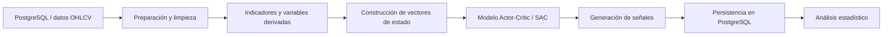

# ModeloAR

Proyecto experimental de analítica y aprendizaje por refuerzo aplicado a series temporales financieras.

El repositorio reúne componentes desarrollados en Python para consultar y preparar datos almacenados en PostgreSQL, construir vectores de estado a partir de información OHLCV e indicadores técnicos, entrenar modelos de tipo Actor-Critic y generar señales para su evaluación posterior.

## Objetivo

Explorar un flujo reproducible para transformar datos de mercado en representaciones útiles para modelos de aprendizaje automático y aprendizaje por refuerzo, manteniendo separadas las etapas de preparación, entrenamiento, generación de señales y análisis estadístico.

## Arquitectura general



## Tecnologías utilizadas

- Python
- PostgreSQL / SQL mediante `psycopg2`
- Pandas y NumPy
- scikit-learn
- PyTorch
- FastAPI
- Matplotlib / Seaborn

## Componentes principales

### `state_builder.py`

Consulta datos desde PostgreSQL, procesa columnas OHLCV y variables adicionales, calcula indicadores como RSI y ATR, normaliza variables y construye representaciones numéricas para el modelado.

### `data_split_and_save.py`

Realiza una separación temporal entre conjuntos de entrenamiento y prueba y persiste los resultados nuevamente en PostgreSQL.

### `sac_model_config.py` y `sac_training.py`

Contienen la definición y experimentación con una arquitectura Actor-Critic inspirada en Soft Actor-Critic (SAC), implementada con PyTorch.

### `generate_trading_signals.py`

Carga artefactos de modelado, consulta datos de prueba desde PostgreSQL y genera señales que pueden almacenarse para evaluación posterior.

### `Trading_Signals_Stats.py`

Realiza análisis descriptivo de las señales almacenadas y explora relaciones entre resultados, RSI, ATR y parámetros de gestión.

### `server_tabla_AR.py`

Incluye una capa de servicio con FastAPI y lógica de acceso a PostgreSQL para trabajar con los datos de entrada del modelo.

## Configuración segura

Las credenciales no deben almacenarse en el repositorio.

1. Copia `config4h.example.json` como `config4h.json`.
2. Completa localmente los datos de PostgreSQL y la API requerida.
3. No hagas commit de `config4h.json`; está excluido mediante `.gitignore`.

```bash
cp config4h.example.json config4h.json
```

En Windows PowerShell:

```powershell
Copy-Item config4h.example.json config4h.json
```

## Notas sobre el proyecto

Este repositorio corresponde a una etapa experimental de investigación y desarrollo. Algunos scripts conservan decisiones de implementación propias de esa fase y pueden requerir parametrización adicional para ejecutarse en un entorno distinto al original.

El objetivo de su publicación es mostrar la evolución del trabajo con Python, SQL/PostgreSQL, procesamiento de datos y modelos de aprendizaje automático, no presentar un sistema de trading listo para producción.

## Seguridad

Si una credencial ha sido publicada previamente en el historial de Git, debe considerarse comprometida y rotarse en el proveedor correspondiente. Eliminarla del último commit no invalida copias anteriores presentes en el historial.
